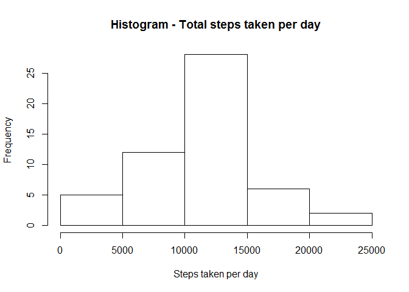
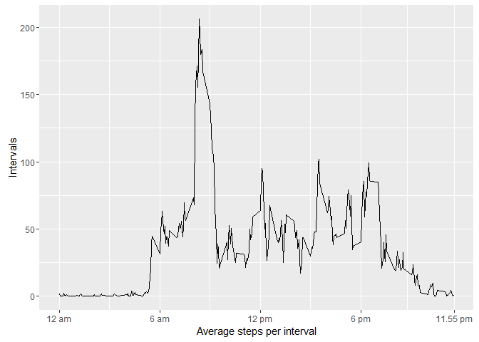
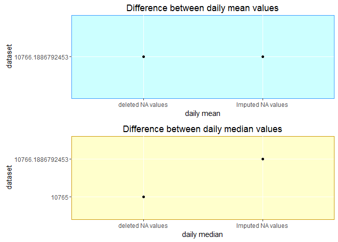
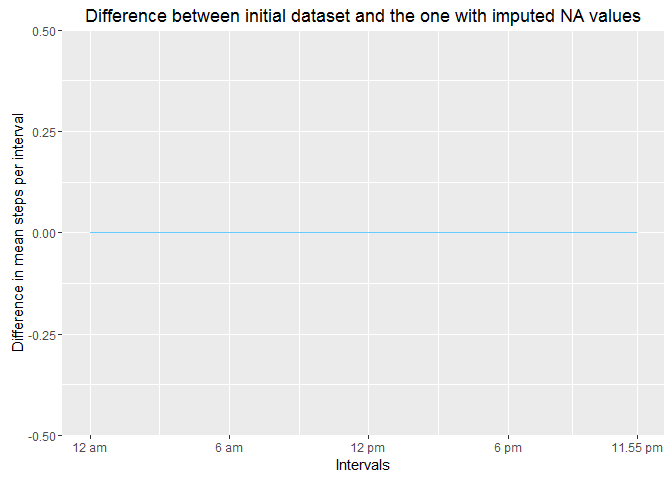
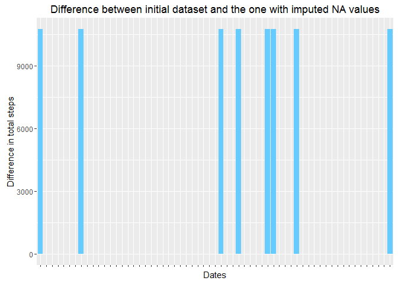

# Reproducible Research: Peer Assessment 1

## Loading required packages
Install packages if necessary and load them into the workspace

```r
list.of.packages <- c("ggplot2","gridExtra")
new.packages <- list.of.packages[!(list.of.packages %in% installed.packages()[,"Package"])]
if(length(new.packages)) install.packages(new.packages)
library(ggplot2)
par(mfrow=c(1,1))
```


## Loading and preprocessing the data
Let's load the activity csv-file and have a look at its structure:


```r
act_withna <- read.csv("activity.csv")
```

Now, let us sort out NA values, which are only present in the steps variable.


```r
act_wona <- act_withna[which(!is.na(act_withna$steps)),]
```

Let us save a set of activity values without date class (as it does not work on aggregate)

```r
act_wona$date <- as.character(act_wona$date)
act_withna$date <- as.character(act_withna$date)
```


## What is mean total number of steps taken per day?

Calculate the sum of steps per day


```r
attach(act_wona)
act_wona_agg_date <- aggregate(x=steps,by=list(date=date),FUN=sum)
detach(act_wona)
```

Show the histogram of total steps taken per day


```r
hist(act_wona_agg_date$x,main="Histogram - Total steps taken per day",xlab= "Steps taken per day", ylab="Frequency")
```

<!-- -->

Calculate the mean and median values of the total steps taken per day


```r
act_wona_agg_date_mean <- mean(act_wona_agg_date$x)
act_wona_agg_date_median <- median(act_wona_agg_date$x)
```

The mean value is 1.0766189\times 10^{4} and the median value is 10765

## What is the average daily activity pattern?

Show the average daily activity pattern by taking the mean of each interval across all days


```r
attach(act_wona)
act_wona_agg_int <-aggregate(x=steps,by=list(interval=interval),FUN=mean)
detach(act_wona)
ggplot(act_wona_agg_int) + geom_line(aes(x=act_wona_agg_int$interval,y=act_wona_agg_int$x)) + scale_x_continuous(limits=c(0,2355),breaks=c(0,0600,1200,1800,2355),labels=c("12 am","6 am","12 pm","6 pm","11.55 pm")) + labs(x="Average steps per interval",y="Intervals")
```

<!-- -->

```r
act_wona_agg_int_maxintval <- max(act_wona_agg_int$x)
act_wona_agg_int_maxint <- which.max(act_wona_agg_int$x)
```

The interval with highest average value (206.1698113) is the interval at 104

## Imputing missing values

Calculate the number of missing values.


```r
missingvaluesnumber <- sum(!complete.cases(act_withna))
missingvaluespercentage <-round((sum(!complete.cases(act_withna))/dim(act_withna)[1])*100,2)
```

There are 2304 missing values in the data set, which make of 13.11% of the whole data set.

Before imputing mean values to replace the missing values in the "steps" columns, let us create the future "activity without NA" data frame.


```r
act_narep <- act_withna
```

Then, design a function which looks for the mean value for any given interval.


```r
imputemean <- function(giveninterval){
  return (act_wona_agg_int[which(act_wona_agg_int$interval==giveninterval),]$x)
}
```

Finally, go through all the rows containing missing values and replace the NA value by mean values of the given interval. 


```r
for (i in as.integer(row.names(act_withna[which(is.na(act_withna$steps)==TRUE),]))) {
  act_narep$steps[i] <- imputemean(act_narep$interval[i])
}
```

Calculate total number of steps per day by using the newly created dataset with NA values replaced by mean values (activity without NA values - actwona).


```r
attach(act_narep)
act_narep_agg_date <- aggregate(x=steps,by=list(date=date),FUN=sum)
act_narep_agg_int <-aggregate(x=steps,by=list(interval=interval),FUN=mean) #this is for further use
detach(act_narep)
```

Now let us have a look at the difference of mean and median values between the data set with deleted NA values and the one with replaced NA values

First, calculate mean and median values of the new data set, containing imputed NA values.


```r
act_narep_agg_date_mean <- mean(act_narep_agg_date$x)
act_narep_agg_date_median <- median(act_narep_agg_date$x)
```

Then, let us compare those numbers with the ones of the initial dataset (with deleted NA values) :


```r
temp_datanames <- c("Imputed NA values","deleted NA values")
comparison_mean <- data.frame(cbind(temp_datanames,rbind(act_narep_agg_date_mean,act_wona_agg_date_mean)))
colnames(comparison_mean)<-c("dataset","value")
comparison_median <- data.frame(cbind(temp_datanames,rbind(act_narep_agg_date_median,act_wona_agg_date_median)))
colnames(comparison_median)<-c("dataset","value")

plot1 <- qplot(x=comparison_mean$dataset,y=comparison_mean$value,main="Difference between daily mean values",xlab="daily mean",ylab="dataset")+theme(panel.background = element_rect(fill = '#ccffff', colour = '#3399ff'))
plot2 <- qplot(x=comparison_median$dataset,y=comparison_median$value,main="Difference between daily median values",xlab="daily median",ylab="dataset")+theme(panel.background = element_rect(fill = '#ffffcc', colour = '#cc9900'))
library(gridExtra)
grid.arrange(plot1, plot2, nrow=2, ncol=1)
```

<!-- -->

However the total number of steps is clearly higher in the dataset with imputed NA values (6.5673751\times 10^{5}) than in the initial dataset (570608).


The difference between mean per interval is none :


```r
comparison_int <- merge(act_narep_agg_int,act_wona_agg_int,by="interval",all = T)
comparison_int <- comparison_int[order(comparison_int$interval),]
names(comparison_int)<-c("interval","Replaced NAs","Initial Values")
comparison_int[which(is.na(comparison_int$`Initial Values`)),3]<-rep(0,dim(comparison_int[which(is.na(comparison_int$`Initial Values`)),])[1])
comparison_int$difference <- (comparison_int$`Replaced NAs` - comparison_int$`Initial Values`)
ggplot(comparison_int,aes(x=comparison_int$interval,y=comparison_int$difference))+geom_line(stat="identity",position="stack",colour="#66ccff")+labs(x = "Intervals", y = "Difference in mean steps per interval",title="Difference between initial dataset and the one with imputed NA values")+scale_x_continuous(limits = c(0,2355),breaks=c(0,0600,1200,1800,2355),labels =c("12 am","6 am","12 pm","6 pm","11.55 pm"))
```

<!-- -->


The 


```r
comparison <- merge(act_narep_agg_date,act_wona_agg_date,by="date",all = T)
comparison <- comparison[order(comparison$date),]
names(comparison)<-c("date","Replaced NAs","Initial Values")
comparison[which(is.na(comparison$`Initial Values`)),3]<-rep(0,dim(comparison[which(is.na(comparison$`Initial Values`)),])[1])
comparison$difference <- (comparison$`Replaced NAs` - comparison$`Initial Values`)
ggplot(comparison,aes(x=comparison$date,y=comparison$difference))+geom_bar(stat="identity",position="stack",fill="#66ccff")+labs(x = "Dates", y = "Difference in total steps",title="Difference between initial dataset and the one with imputed NA values")+theme(axis.text.x=element_blank())
```

<!-- -->

##set date pattern side by side
act_narep_agg_date$set <- rep("Replaced NAs",length(dim(act_narep_agg_date)[1]))
act_wona_agg_date$set <- rep("Initial Values",length(dim(act_wona_agg_date)[1]))
comparison <- rbind(act_narep_agg_date,act_wona_agg_date)
comparison <- comparison[order(comparison$date),]
ggplot(comparison,aes(x=comparison$date,y=comparison$x))+geom_bar(stat="identity",aes(fill=comparison$set),position="dodge")

##set date pattern line&ribbon presentation
act_narep_agg_date$set <- rep("Replaced NAs",length(dim(act_narep_agg_date)[1]))
act_wona_agg_date$set <- rep("Initial Values",length(dim(act_wona_agg_date)[1]))
comparison <- rbind(act_narep_agg_date,act_wona_agg_date)
comparison <- comparison[order(comparison$date),]
ggplot(comparison, aes(Date,DailyTotal, group = as.factor(Set))) + geom_line(aes(colour=Set))+geom_ribbon(aes(ymin=comparison$DailyTotal,ymax=comparison$DailyTotal),fill="blue")

ggplot(comparison, aes(Date,DailyTotal, group = as.factor(Set))) + geom_line(aes(colour=Set))


## Are there differences in activity patterns between weekdays and weekends?


Date variable is saved as a factor, to be converted into date variable

#```{r}
#act_wona$date_factor <- strptime(as.character(act_wona$date),"%Y-%m-%d")
#act_withna$date_factor <- strptime(as.character(act_withna$date),"%Y-%m-%d")
#```

